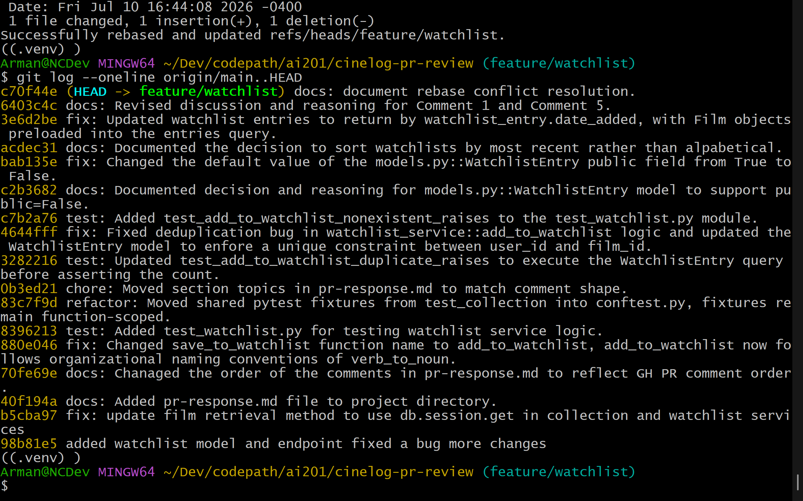

# PR Response Doc — CineLog Watchlist Feature

## AI Usage
I used AI tools to understand SQLAlchemy ORM behavior, particularly the difference between foreign keys, relationships, explicit joins, and eager loading with joinedload. I also used AI to review pytest fixture scope, walk through the rebase conflict-resolution process, and evaluate whether my commit messages followed Conventional Commits.
For Comment 4, I asked whether duplicate prevention should exist in both the application and database layers. The AI identified that the application check provides a clear domain-specific error, while the database constraint protects the invariant from concurrent requests and code paths that bypass the service. My final implementation applies both protections and verifies the behavior with a duplicate-entry test.
For Comment 5, I asked AI to challenge the newest-first position. It raised the counterarguments that alphabetical order is more predictable when locating a known title and that newest-first can bury older entries. My final reasoning still recommends newest-first as the default, but acknowledges those drawbacks, proposes selectable sort options, and identifies the need for a secondary key when timestamps are equal.

## Comment 1 — Default Visibility
**My position:**
I agree with the dev-lead on this PR topic. The defaulted value of public=True for a user's watchlist may signal a loss of watchlist control and ownership to the user if the property field is not explicitly stated to the user.
**Reasoning:**
User's typically would prefer that their creations remain private unless the platform explicitly informs the user of its purpose. For this reason, I believe that the default value for the public property should be set to False and the option to change it to True should be directly shown to the user during the Watchlist creation.

I think we should also discuss whether the public property displays the watchlist to the entire userbase or to a user's community. Private watchlist may have the potential to be shared via a specialized link - which the user can then share to their friend.
**Tradeoff acknowledged:**
Private-by-default protects users from unintentionally exposing their interests, but it may reduce public discovery and sharing. If social discovery is a primary product goal, public-by-default with prominent disclosure could be justified. We should also clarify whether visibility applies to an entire watchlist or individual entries.

## Comment 2 — Missing test
**What I did:**
I added the test function test_add_to_watchlist_nonexistent_raises() to the test_watchlist module. This test enforces the film_id validation from the database in lines 29-31 of watchlist_service.py::add_to_watchlist - before a new WatchlistEntry is created.
**How I verified:**
I ran the test with pytest tests/test_watchlist.py::test_add_to_watchlist_nonexistent_raises and verified that the test passed. I then ran the entire test suite with pytest /tests and verified that all existing tests across the suit passed.

## Comment 3 — Rename
**What I did:**
To rename save_to_watchlist to add_to_watchlist, I ran the keyboard command Shift + F12 on the save_to_watchlist phrase which showed me all of the instances of the phrase in the project directory. I manually changed 'save' to 'add'.
**How I verified:**
This fix was verified by running a global search (CTRL + SHIFT + F) and running a search for 'save_to_watchlist'. The search returned empty.

## Comment 4 — Deduplication
**What I did:**
To resolve this bug, I noticed that the WatchlistEntry model in models.py and watchlist_service.py::add_to_watchlist did not include checks for duplication at the database and application layer.

Using the existing duplication check from collection_service.py, I created AlreadyInWatchlistError and implemented the application layer check in add_to_watchlist to raise that error if an entry is found.

Additionally, I added a unique constraint to at the database layer by adding the (user_id, film_id) constraint to the WatchlistEntry model.
**How I verified:**
The bug fix was verified by creating a new test_watchlist module with test_add_to_watchlist_duplicate_raises.

This test function test the fixed add_to_watchlist function and WatchlistEntry model to assert that AlreadyinWatchlistError raises if an entry is found before trying to add the film to the user's watchlist.

## Comment 5 — Sort order
**My position:**
I agree with the maintainer on this comment. User's would benefit from seeing their most recently added films first rather than an alphabetical approach.
**Reasoning:**
Newest-first is a sensible default because it confirms recent additions and reflects current interest. However, it can bury older entries and is less useful when someone is looking for a known title. Ideally, the UI should support alternative sorting such as alphabetical, oldest-added, and newest-added, while using newest-first as the initial default.

Additionally, sorting only by date_added can be nondeterministic when two entries have the same timestamp. A stable ordering could add a secondary key: 
```
.order_by(
    WatchlistEntry.date_added.desc(),
    WatchlistEntry.id.asc(),
)
```
**Engagement with reviewer's point:**
I completely agree with your point here. User's are more likely to be interested in a film they've just recently added or heard of. Rather than having the user go through the roadblock of searching for what they've just added, we can just show their recents first. However, a strong tradeoff to this approach describes burying older entries under newer additions. This could be less useful to the user if they are limited to searching by date_added.

## Comment 6 — Rebase
**What conflicted:**
The rebase produced an add/add conflict in `.gitignore` because both `main` and my feature branch had added the file independently. It also produced a conflict in `models.py` when the watchlist deduplication commit was replayed: updated `main` had migrated film IDs from integers to UUID strings, while the watchlist branch still defined `WatchlistEntry.film_id` as an integer.

**How I resolved it:**
I skipped the feature branch's `.gitignore` commit because `main` already contained the same rules plus an additional `.pytest_cache/` rule. In `models.py`, I retained the UUID definitions from `main` and the watchlist changes from my feature branch. In particular, I changed `WatchlistEntry.film_id` to `db.String(36)` so it matches `Film.id`, while preserving the relationship and unique constraint on `(user_id, film_id)`. I then staged the resolved file and continued the rebase until all feature commits had been replayed.

**How I verified no conflict remains:**
I ran the full test suite and all 6 tests passed. I inspected the diff against `origin/main` to confirm that `WatchlistEntry.film_id` uses `db.String(36)`, checked that the working tree was clean, and reviewed the feature-only commit graph. I also ran `git log --merges --oneline origin/main..HEAD` to confirm that the rebased feature history contains no merge commits.

## PR Description
# CineLog Watchlist Feature

## Summary

This PR adds a watchlist feature to CineLog. Users can add films they intend to watch and retrieve their saved films through the watchlist API. Each returned film includes its watchlist metadata, including when it was added and whether the entry is public.

The implementation also:

- Uses UUID film IDs introduced by the updated `main` branch.
- Prevents the same user from adding the same film more than once.
- Raises a domain-specific error when a duplicate is detected.
- Validates that a film exists before creating an entry.
- Loads related `Film` objects efficiently when retrieving a watchlist.
- Adds tests for successful additions, duplicate entries, and nonexistent films.

## Design Decisions

### Visibility Default

New watchlist entries default to `public=False`. This prevents users from unintentionally exposing their saved films. The tradeoff is reduced discoverability and additional effort when users want to share entries. A future interface should make visibility clear and allow users to change it intentionally.

### Sort Order

Watchlist entries are returned newest-first using `date_added`. This makes recent additions easy to confirm and reflects a user's current interests. The tradeoff is that older entries may become harder to find. A future interface could offer newest-added, oldest-added, and alphabetical sorting.

## Manual Testing

1. Install the dependencies and start the application:

   ```bash
   pip install -r requirements.txt
   python app.py
   ```

2. In another terminal, open a Flask shell:

   ```bash
   flask --app app:create_app shell
   ```

3. Create a test user and two films:

   ```python
   from app import db
   from models import User, Film

   user = User(username="watchlist-test", email="watchlist@example.com")
   film_one = Film(title="Alien", year=1979, genre="Horror")
   film_two = Film(title="Paddington 2", year=2017, genre="Comedy")

   db.session.add_all([user, film_one, film_two])
   db.session.commit()

   print("USER_ID:", user.id)
   print("FILM_ONE_ID:", film_one.id)
   print("FILM_TWO_ID:", film_two.id)
   ```

4. Record the three UUIDs printed by the shell, then exit:

   ```python
   exit()
   ```

5. Add the first film, replacing the placeholders with those UUIDs:

   ```bash
   curl -X POST http://localhost:5000/watchlist/<USER_ID>/add \
     -H "Content-Type: application/json" \
     -d '{"film_id":"<FILM_ONE_ID>"}'
   ```

6. Add the second film:

   ```bash
   curl -X POST http://localhost:5000/watchlist/<USER_ID>/add \
     -H "Content-Type: application/json" \
     -d '{"film_id":"<FILM_TWO_ID>"}'
   ```

7. Retrieve the user's watchlist:

   ```bash
   curl http://localhost:5000/watchlist/<USER_ID>
   ```

8. Confirm that:

   - Both films are returned.
   - The second film appears first because it was added most recently.
   - Each result includes `date_added`.
   - Each result has `"public": false`.
   - The returned film IDs are UUID strings.

9. Run the automated regression suite:

   ```bash
   pytest tests/
   ```

   Confirm that all six tests pass.


## Git Log: origin/main..HEAD

